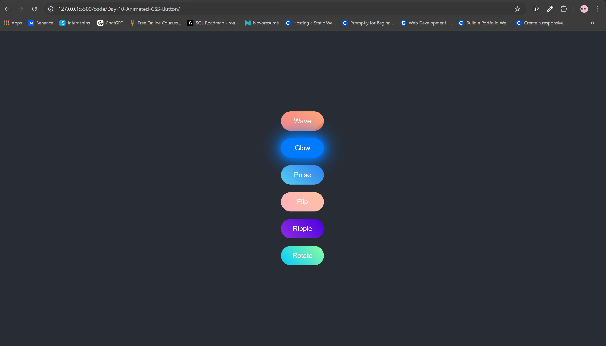

<h1>Day 10: Animated CSS Buttons</h1>

Welcome to Day 10 of our CSS animation challenge! This repository contains a collection of unique and trendy animated CSS buttons. Each button showcases a different animation effect to enhance the user experience and add visual interest to your web projects.

<h2>Demo</h2>

You can view a live demo of the buttons <a href="https://codepen.io/Yashi-the-lessful/pen/RwmMLre">here</a>.

Preview Image

<h2>Buttons Included</h2>
<ul>
    <li><strong>Wave Button</strong></li>
    <li><strong>Glow Button</strong></li>
    <li><strong>Pulse Button</strong></li>
    <li><strong>Flip Button</strong></li>
    <li><strong>Ripple Button</strong></li>
    <li><strong>Rotate Button</strong></li>
</ul>

<h2>Project Structure</h2>
<pre>
Day-10-Animated-CSS-Button/
├── index.html
├── styles.css
└── README.md
</pre>

<h2>Getting Started</h2>

To get a local copy up and running, follow these simple steps.

<h3>Prerequisites</h3>

You will need a modern web browser and a text editor.

<h3>Installation</h3>
<ol>
    <li>Clone the repository:
        <pre><code>git clone https://github.com/Yashi-Singh-1/Day-10-Animated-CSS-Button.git</code></pre>
    </li>
    <li>Navigate to the project directory:
        <pre><code>cd Day-10-Animated-CSS-Button</code></pre>
    </li>
    <li>Open <code>index.html</code> in your web browser to see the animated buttons in action.</li>
</ol>

<h2>Usage</h2>

Each button is styled using CSS animations and transitions. You can integrate these buttons into your own projects by copying the relevant HTML and CSS code.

<h2>Contributing</h2>

Contributions are what make the open source community such an amazing place to learn, inspire, and create. Any contributions you make are <strong>greatly appreciated</strong>.

<ol>
    <li>Fork the Project</li>
    <li>Create your Feature Branch (<code>git checkout -b feature/YourFeature</code>)</li>
    <li>Commit your Changes (<code>git commit -m 'Add some YourFeature'</code>)</li>
    <li>Push to the Branch (<code>git push origin feature/YourFeature</code>)</li>
    <li>Open a Pull Request</li>
</ol>

<h2>License</h2>

Distributed under the MIT License. See <code>LICENSE</code> for more information.

<h2>Contact</h2>

Yashi Singh - <a href="www.linkedin.com/in/yashi-singh-b4143a246">www.linkedin.com/in/yashi-singh-b4143a246</a>

Thanks for checking out this project! Enjoy the animations and happy coding!

